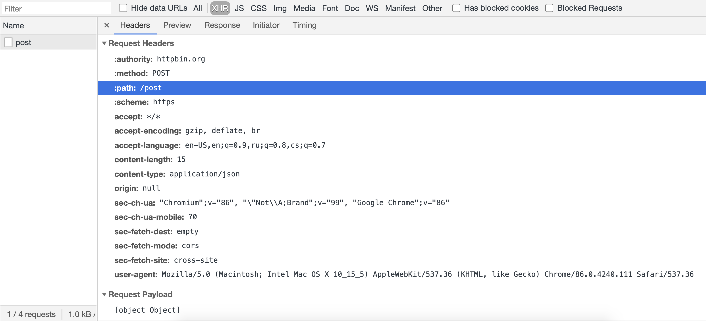
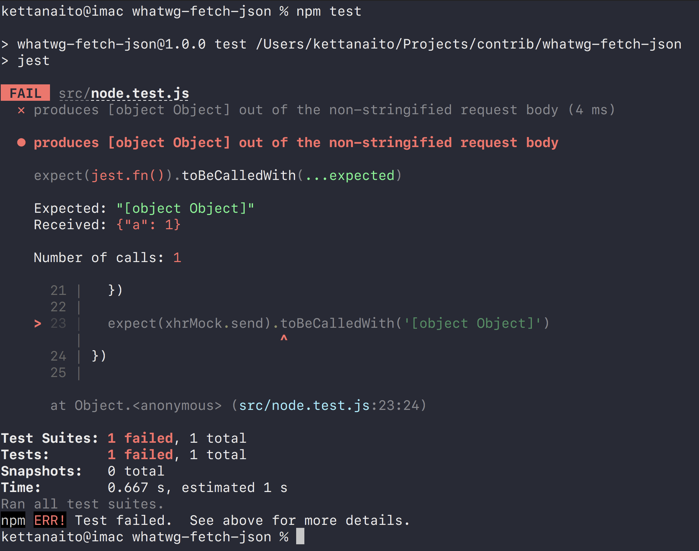

## Reproduction steps

```bash
$ npm install
```

### Browser

1. Open `src/index.html` file in your browser.
1. Open the DevTools, navigate to the "Network" tab.
1. Find the respective network entry for the request. See its "Request payload" to be "[object Object]":



### NodeJS

```bash
$ npm test
```

See the test suite failing:


